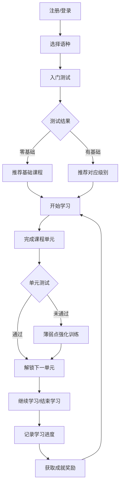
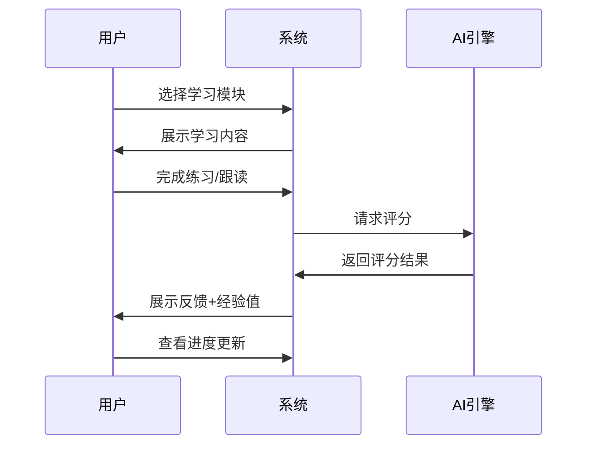

# LinguaFlow 多语种在线学习平台 - 产品需求文档

## 1. 产品概述

LinguaFlow 是一款沉浸式多语种在线学习平台，支持英语、日语、韩语等主流语言的学习。平台通过创新的交互设计和游戏化元素，为用户打造如同环游世界般的语言学习体验，让学习者在探索不同语言文化的过程中高效掌握新技能。

- **核心价值**：将语言学习从枯燥的背单词转变为有趣的环球旅行探索
- **目标用户**：语言爱好者、学生、职场人士、旅行爱好者
- **市场定位**：中高端语言学习平台，强调沉浸式体验和个性化学习路径

## 2. 核心功能

### 2.1 用户角色

| 角色 | 注册方式 | 核心权限 |
|------|----------|----------|
| 游客 | - | 浏览首页、课程介绍、部分免费内容 |
| 注册用户 | 邮箱/手机号注册，第三方登录（Google/Apple） | 完整学习功能、社区互动、进度追踪 |
| VIP用户 | 付费升级 | 高级课程、专属学习路径、一对一辅导 |

### 2.2 功能模块

1. **首页 (Home)**
   - Hero展示区：3D地球动画，展示支持的语种
   - 导航栏：课程、学习中心、社区、成就、我的
   - 课程推荐区：根据用户偏好推荐课程
   - 学习数据统计：每日学习时长、连续学习天数
   - 底部：APP下载、社交媒体、合作伙伴

2. **课程页面 (Courses)**
   - 语种选择：英语、日语、韩语等（卡片式展示）
   - 级别筛选：零基础 → 初级 → 中级 → 高级 → 精通
   - 课程卡片：封面图、课程名、难度等级、预计时长、学员数量
   - 课程详情页：课程大纲、试听章节、学习人数、评价

3. **学习中心 (Learning Center)**
   - 单词记忆模块：卡片式记忆、间隔重复算法（SM-2）
   - 语法练习模块：互动填空、即时反馈
   - 口语跟读模块：AI评分、波形可视化
   - 听力训练模块：逐句听力、变速播放、听写模式

4. **学习进度追踪 (Progress)**
   - 整体进度：完成百分比、星级评分
   - 技能雷达图：听力、口语、阅读、写作
   - 学习日历：每日学习记录、热力图展示
   - 历史战绩：正确率曲线、薄弱点分析

5. **个性化推荐 (Recommendation)**
   - 入门测试：根据测试结果推荐起始级别
   - 学习路径：基于AI分析推荐下一课
   - 薄弱点强化：针对错题提供专项训练

6. **社区交流 (Community)**
   - 话题广场：按语种/话题分类
   - 学习小组：组队学习、PK挑战
   - 笔记分享：学习心得、技巧总结
   - 外教答疑：实时问答互动

7. **成就激励系统 (Achievements)**
   - 成就徽章：学习里程碑、特殊成就
   - 等级系统：学习者等级、经验值升级
   - 排行榜：日榜、周榜、总榜
   - 虚拟奖励：虚拟货币、装饰物品

8. **用户中心 (Profile)**
   - 个人信息：头像、昵称、学习目标
   - 账户设置：语言偏好、通知设置
   - VIP管理：订阅计划、续费
   - 学习报告：周期性总结

## 3. 核心流程

### 3.1 用户学习流程

### 3.2 学习模块交互流程

## 4. 用户界面设计

### 4.1 设计风格

**设计理念：环游世界的语言探险家**

- **视觉基调**：复古旅行地图 + 现代极简主义
- **主色调**：
  - 主色：#1A365D（深蓝航海色）
  - 辅助色：#F6AD55（温暖日出橙）
  - 强调色：#48BB78（成功绿）、#E53E3E（警示红）
- **字体**：
  - 标题：Playfair Display（优雅衬线体）
  - 正文：Noto Sans SC / Noto Sans JP / Noto Sans KR（各语言适配）
  - 数字：DM Sans（现代感）
- **按钮风格**：圆角卡片式（border-radius: 16px），悬停时轻微上浮 + 阴影加深
- **图标风格**：线性图标，带有轻微的手绘质感
- **布局**：卡片式布局，大量留白，信息层次分明

### 4.2 页面设计概览

| 页面名称 | 模块名称 | UI元素与交互 |
|----------|----------|--------------|
| 首页 | Hero地球 | 3D旋转地球，鼠标悬停显示语种标记点 |
| 首页 | 导航栏 | 玻璃态效果，滚动时背景模糊加深 |
| 首页 | 课程卡片 | 悬停时卡片翻转，显示课程详情预览 |
| 课程页 | 语种选择器 | 大型卡片，带有国旗和语言特色装饰 |
| 学习页 | 单词卡片 | 3D翻转效果，正面单词/背面释义+例句 |
| 学习页 | 跟读界面 | 波形动画，录音时的心跳脉动效果 |
| 学习页 | 听力练习 | 进度条拖拽，句子高亮同步 |
| 成就页 | 徽章墙 | 成就解锁动画，金币撒花效果 |
| 社区页 | 帖子卡片 | 点赞/评论动画，用户头像装饰框 |

### 4.3 响应式设计

- **桌面端（>1200px）**：多列布局，大型交互元素
- **平板端（768px-1200px）**：双列布局，触摸优化
- **移动端（<768px）**：单列布局，底部导航栏，全屏学习模式

### 4.4 动效设计

- **页面切换**：共享元素过渡（如课程卡片→课程详情）
- **加载状态**：骨架屏 + 脉冲动画
- **成功反馈**：粒子爆炸 + 音效
- **学习提醒**：每日推送动画气泡

## 5. 验收标准

### 5.1 功能验收

- [ ] 用户可完成注册、登录、登出流程
- [ ] 用户可选择语种并开始学习
- [ ] 四大学习模块（单词/语法/口语/听力）可正常使用
- [ ] 学习进度可正确保存和显示
- [ ] 成就系统可正确解锁和展示
- [ ] 社区帖子可发布和查看
- [ ] 个性化推荐基于用户数据展示

### 5.2 视觉验收

- [ ] 整体风格统一，无明显风格冲突
- [ ] 动画流畅，无卡顿（60fps目标）
- [ ] 响应式布局各断点正常显示
- [ ] 深色/浅色模式切换正常
