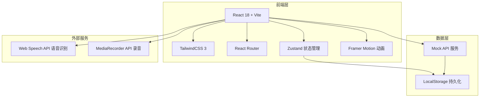

# LinguaFlow 技术架构文档

## 1. 架构设计



## 2. 技术选型

| 类别 | 技术 | 版本 | 说明 |
|------|------|------|------|
| 框架 | React | 18.x | 核心框架，组件化开发 |
| 构建工具 | Vite | 5.x | 快速开发服务器和构建 |
| CSS框架 | TailwindCSS | 3.x | 原子化CSS，高效样式开发 |
| 路由 | React Router | 6.x | SPA路由管理 |
| 状态管理 | Zustand | 4.x | 轻量级状态管理 |
| 动画 | Framer Motion | 11.x | 声明式动画 |
| 图表 | Recharts | 2.x | 数据可视化 |
| 图标 | Lucide React | 最新 | 线性图标库 |

## 3. 路由定义

| 路由 | 页面 | 说明 |
|------|------|------|
| `/` | 首页 | 展示平台概览、课程推荐 |
| `/courses` | 课程列表 | 语种选择、级别筛选 |
| `/courses/:language` | 课程详情 | 特定语种课程列表 |
| `/courses/:language/:courseId` | 课程内容 | 章节列表、学习入口 |
| `/learn/:courseId/:moduleType` | 学习模块 | 单词/语法/口语/听力 |
| `/progress` | 学习进度 | 进度追踪、数据统计 |
| `/community` | 社区广场 | 帖子列表、小组入口 |
| `/achievements` | 成就中心 | 徽章墙、排行榜 |
| `/profile` | 个人中心 | 账户设置、VIP管理 |

## 4. 数据模型

### 4.1 用户数据模型

```typescript
interface User {
  id: string;
  email: string;
  nickname: string;
  avatar: string;
  role: 'guest' | 'user' | 'vip';
  targetLanguage: 'en' | 'jp' | 'kr' | null;
  currentLevel: number;
  experience: number;
  streak: number; // 连续学习天数
  joinedAt: string;
}
```

### 4.2 课程数据模型

```typescript
interface Course {
  id: string;
  language: 'en' | 'jp' | 'kr';
  title: string;
  description: string;
  level: 'beginner' | 'elementary' | 'intermediate' | 'advanced' | 'proficient';
  coverImage: string;
  totalUnits: number;
  completedUnits: number;
  duration: string; // 预计完成时间
  studentsCount: number;
  rating: number;
}

interface Unit {
  id: string;
  courseId: string;
  title: string;
  order: number;
  vocabulary: Vocabulary[];
  grammar: Grammar[];
  dialogues: Dialogue[];
  exercises: Exercise[];
}
```

### 4.3 学习进度模型

```typescript
interface LearningProgress {
  oderId: string;
  courseId: string;
  unitId: string;
  vocabularyProgress: VocabularyProgress[];
  grammarProgress: GrammarProgress[];
  speakingProgress: SpeakingProgress[];
  listeningProgress: ListeningProgress[];
  lastStudyDate: string;
  completedAt: string | null;
}

interface VocabularyProgress {
  wordId: string;
  correctCount: number;
  wrongCount: number;
  nextReviewDate: string;
  mastery: number; // 0-100
}
```

### 4.4 成就数据模型

```typescript
interface Achievement {
  id: string;
  title: string;
  description: string;
  icon: string;
  category: 'streak' | 'course' | 'skill' | 'social';
  requirement: number;
  reward: number; // 经验值奖励
  unlockedAt: string | null;
}
```

## 5. 组件架构

```
src/
├── components/
│   ├── common/          # 通用组件
│   │   ├── Button/
│   │   ├── Card/
│   │   ├── Modal/
│   │   └── Loading/
│   ├── layout/          # 布局组件
│   │   ├── Header/
│   │   ├── Sidebar/
│   │   └── Footer/
│   ├── home/            # 首页组件
│   │   ├── Hero/
│   │   ├── CourseCard/
│   │   └── StatsBar/
│   ├── course/          # 课程组件
│   │   ├── CourseList/
│   │   ├── CourseDetail/
│   │   └── UnitCard/
│   ├── learning/        # 学习模块组件
│   │   ├── VocabularyCard/
│   │   ├── GrammarExercise/
│   │   ├── SpeakingRecorder/
│   │   └── ListeningPlayer/
│   ├── progress/         # 进度组件
│   │   ├── ProgressChart/
│   │   ├── SkillRadar/
│   │   └── Calendar/
│   ├── community/       # 社区组件
│   │   ├── PostCard/
│   │   ├── CommentList/
│   │   └── GroupCard/
│   └── achievement/     # 成就组件
│       ├── BadgeWall/
│       ├── Leaderboard/
│       └── RewardPopup/
├── pages/               # 页面组件
├── hooks/              # 自定义Hooks
├── stores/             # Zustand状态库
├── services/           # API服务
├── utils/              # 工具函数
└── data/               # Mock数据
```

## 6. 核心功能实现说明

### 6.1 单词记忆模块 (SM-2算法)

```typescript
// 间隔重复算法实现
function calculateNextReview(quality: number, interval: number, repetitions: number) {
  // quality: 0-5 (回答质量)
  // 返回下次复习日期和新的间隔
}
```

### 6.2 语音评测 (Web Speech API)

- 使用 `SpeechRecognition` 进行语音转文字
- 使用 `MediaRecorder` 进行音频录制
- 回放对比原声波形

### 6.3 进度追踪 (LocalStorage持久化)

```typescript
// Zustand + persist 中间件
const useProgressStore = create(
  persist(
    (set, get) => ({
      progress: {},
      updateProgress: (courseId, unitId, data) => {/*...*/}
    }),
    { name: 'linguaflow-progress' }
  )
);
```

## 7. 性能优化策略

- 路由懒加载：`React.lazy()` + `Suspense`
- 图片优化：WebP格式、懒加载
- 动画优化：`will-change`、GPU加速
- 状态优化：Zustand选择器避免不必要渲染
